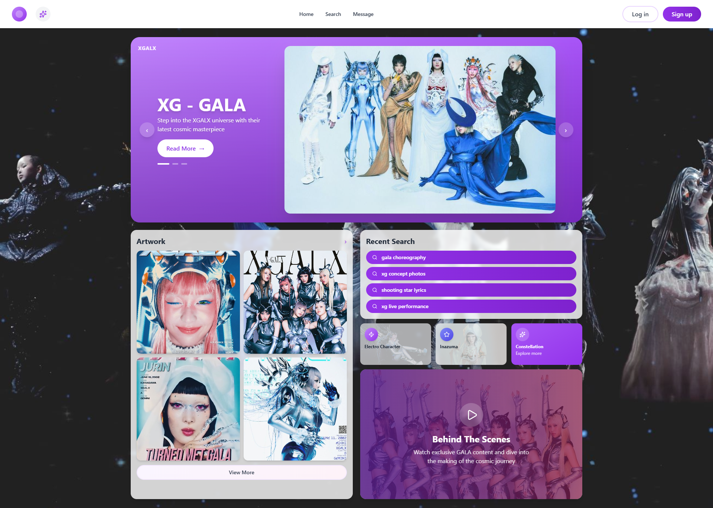

# XG GALA - Hero Section

<div align="center">


**Hero section inspirada no MV GALA do grupo de J-Pop XG 🌟**

Landing page moderna com design vibrante e dinâmico

</div>

---

## Sobre o Projeto

**XG GALA Hero Section** é uma landing page desenvolvida como homenagem ao grupo de J-Pop XG e seu icônico MV "GALA". O projeto apresenta um design moderno e vibrante, capturando a energia e sofisticação do grupo.

### Características Principais

- Design inspirado no conceito visual do MV GALA
- Totalmente responsivo para todos os dispositivos
- Performance otimizada com Vite
- Animações e transições suaves
- Arquitetura componentizada com React
- Ícones elegantes com Lucide React

---

## Tecnologias Utilizadas

- **[React](https://react.dev/)** `18.3.1` - Biblioteca JavaScript para construção de interfaces
- **[Vite](https://vitejs.dev/)** - Build tool moderna e extremamente rápida
- **[Tailwind CSS](https://tailwindcss.com/)** - Framework CSS utility-first para estilização rápida
- **[Lucide React](https://lucide.dev/)** - Biblioteca de ícones moderna e personalizável
- **[ESLint](https://eslint.org/)** - Linter para manter código limpo e padronizado
- **[PostCSS](https://postcss.org/)** - Ferramenta para transformar CSS
- **[Autoprefixer](https://github.com/postcss/autoprefixer)** - Adiciona prefixos de fornecedores automaticamente

---

## Preview

<div align="center">



</div>

---

## Como Rodar o Projeto

### Pré-requisitos

- Node.js (versão 18 ou superior)
- npm ou yarn

### Instalação

1. **Clone o repositório**

```bash
git clone https://github.com/erikalaiane/xg-gala-hero.git
```

2. **Entre no diretório do projeto**

```bash
cd xg-gala-hero
```

3. **Instale as dependências**

```bash
npm install
```

4. **Inicie o servidor de desenvolvimento**

```bash
npm run dev
```

5. **Abra no navegador**

Acesse [http://localhost:5173](http://localhost:5173)

---

## Scripts Disponíveis

```bash
npm run dev      # Inicia servidor de desenvolvimento
npm run build    # Cria build de produção
npm run preview  # Preview da build de produção
npm run lint     # Executa o linter
npm run deploy   # Faz deploy para GitHub Pages
```

---

## Estrutura do Projeto

```
xg-gala-hero/
├── public/
│   └── images/          # Imagens do site
│       └── capa.png
├── src/
│   ├── components/      # Componentes React
│   ├── App.jsx          # Componente principal
│   ├── main.jsx         # Ponto de entrada
│   └── index.css        # Estilos globais
├── index.html
├── package.json
├── tailwind.config.js   # Configuração do Tailwind
└── vite.config.js       # Configuração do Vite
```

---

## Responsividade

O projeto é totalmente responsivo e testado em:

- Mobile (320px - 767px)
- Tablet (768px - 1023px)
- Desktop (1024px+)
- Large Desktop (1440px+)

---

## Contribuindo

Contribuições são sempre bem-vindas! Para contribuir:

1. Faça um fork do projeto
2. Crie uma branch para sua feature (`git checkout -b feature/MinhaFeature`)
3. Commit suas mudanças (`git commit -m 'Adiciona nova feature'`)
4. Push para a branch (`git push origin feature/MinhaFeature`)
5. Abra um Pull Request

---

## Inspiração

Este projeto foi inspirado no MV "GALA" do grupo de J-Pop **XG** (Xtraordinary Girls), conhecido por suas performances poderosas e conceitos visuais marcantes.

---

## Autora

**Erika Laiane**

[](https://github.com/erikalaiane)
[](https://www.linkedin.com/in/erika-laiane-azevedo)
[](mailto:erikalaianeazevedosantos@gmail.com)

---

<div align="center">

Desenvolvido com 💜 por Erika Laiane

</div>